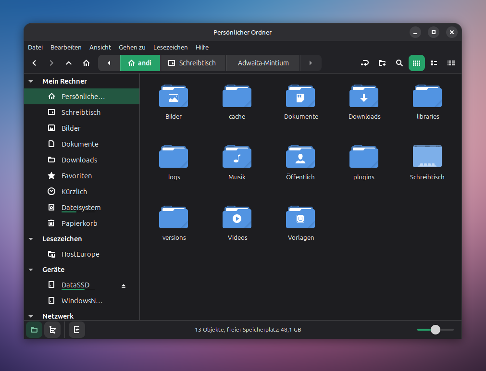

# Adwaita-Mintium

A variation of the inofficial Adwaita GTK theme, optimized for Linux Mint with a more modern design, accent color and enhanced accessibility features.

[](screenshot.png)

## Overview

Adwaita-Mintium is a modern GTK theme that combines the clean aesthetics of Adwaita and adapts it to a more modern look.

### What's Different from original adw-gtk3?

- Rebuilt build system using npm and Dart Sass
- Spacier, more accessible interface elements
- Better visual distinction for folder tabs and navigation
- Mint-specific accent colors and theming
- Improved path segment visibility
- GTK-4 support with libadwaita compatibility

## Installation

### Quick Install

Download from [releases](https://github.com/yourusername/Adwaita-Mintium/releases) and extract to `~/.themes/`, then activate in Themes settings.

### Build from Source

```bash
git clone https://github.com/yourusername/Adwaita-Mintium.git
cd Adwaita-Mintium
npm install -g sass
npm run build
cp -r build/* ~/.themes/
```

Apply through your desktop environment's appearance settings.

## Build Commands

```bash
npm run build           # Build all variants
npm run build:gtk3      # GTK-3 only
npm run build:gtk4      # GTK-4 only
npm run clean           # Clean build directory
```


## Credits

- **Original Theme**: [adw-gtk3](https://github.com/lassekongo83/adw-gtk3) by lassekongo83
- **Recommended Pairings**: [Tela icon theme](https://github.com/vinceliuice/Tela-icon-theme), Bibata cursor theme

## License

LGPL-2.0 License - See [LICENSE](LICENSE) file for details
